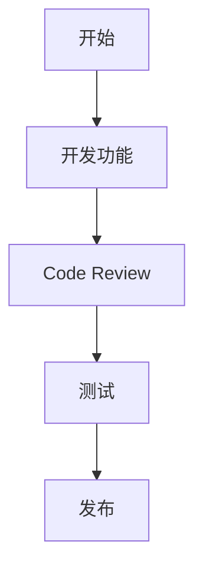
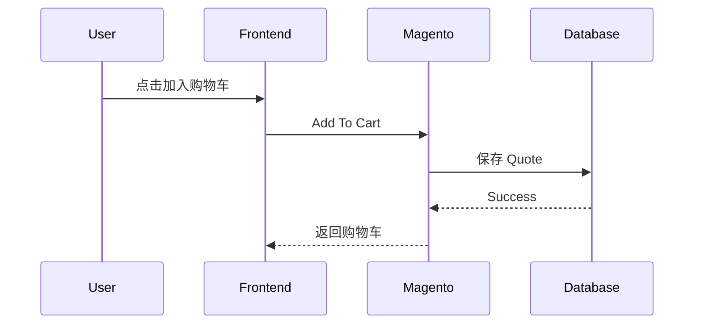
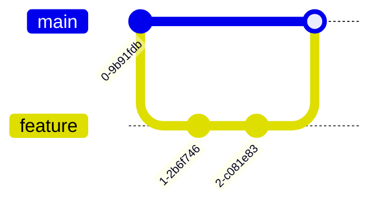
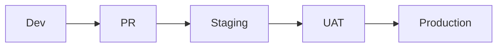

Markdown 是一种轻量级标记语言，通过简单的符号即可完成标题、列表、链接、图片、代码块、表格等内容排版。

Markdown 常用于：

- GitHub README
- 技术文档
- 博客文章
- 项目 Wiki
- 开发笔记
- API 文档
- ChatGPT / AI Prompt 文档

---

## 1. 标题

Markdown 使用 `#` 表示标题。

`#` 的数量代表标题级别，共支持 6 级标题。

语法：

```markdown
# 一级标题

## 二级标题

### 三级标题

#### 四级标题

##### 五级标题

###### 六级标题
```

效果：渲染后分别对应 HTML 的 `<h1>` 到 `<h6>`，字号依次递减（这里不直接渲染，以免打乱本页目录）。

通常一个 Markdown 文档只使用一个一级标题。

---

## 2. 普通文本

Markdown 普通文本不需要任何特殊符号。

示例：

```markdown
这是一段普通文本。

这是第二段文本。
```

效果：

这是一段普通文本。

这是第二段文本。

段落之间建议保留一个空行。

---

## 3. 粗体

使用两个星号 `**` 或两个下划线 `__` 包裹文字。

示例：

```markdown
这是 **粗体文字**。

这是 __粗体文字__。
```

效果：

这是 **粗体文字**。

这是 __粗体文字__。

推荐使用：

```markdown
**粗体**
```

---

## 4. 斜体

使用一个星号 `*` 或一个下划线 `_`。

示例：

```markdown
这是 *斜体文字*。

这是 _斜体文字_。
```

效果：

这是 *斜体文字*。

---

## 5. 粗斜体

使用三个星号 `***`。

示例：

```markdown
这是 ***粗斜体文字***。
```

效果：

这是 ***粗斜体文字***。

---

## 6. 删除线

使用两个波浪线 `~~`。

示例：

```markdown
这是 ~~已经废弃的内容~~。
```

效果：

这是 ~~已经废弃的内容~~。

---

## 7. 无序列表

无序列表可以使用：

- `-`
- `*`
- `+`

推荐统一使用 `-`。

示例：

```markdown
- HTML
- CSS
- JavaScript
- PHP
```

效果：

- HTML
- CSS
- JavaScript
- PHP

---

## 8. 多级无序列表

通过缩进创建子列表。

示例：

```markdown
- 前端
  - HTML
  - CSS
  - JavaScript
- 后端
  - PHP
  - Java
  - Python
```

效果：

- 前端
  - HTML
  - CSS
  - JavaScript
- 后端
  - PHP
  - Java
  - Python

通常使用 2～4 个空格进行缩进。

---

## 9. 有序列表

使用数字加 `.`。

示例：

```markdown
1. 安装依赖
2. 修改配置
3. 启动项目
4. 执行测试
```

效果：

1. 安装依赖
2. 修改配置
3. 启动项目
4. 执行测试

---

## 10. 多级有序列表

示例：

```markdown
1. 安装项目
   1. Clone 项目
   2. 安装依赖
2. 配置项目
   1. 配置数据库
   2. 配置 Redis
3. 启动项目
```

---

## 11. 任务列表

任务列表在 GitHub、GitLab 等平台非常常用。

示例：

```markdown
- [x] 创建项目
- [x] 安装 Magento
- [ ] 开发功能
- [ ] 编写测试
- [ ] 发布 Production
```

效果：

- [x] 创建项目
- [x] 安装 Magento
- [ ] 开发功能
- [ ] 编写测试
- [ ] 发布 Production

其中：

```text
[x]
```

表示已经完成。

```text
[ ]
```

表示未完成。

---

## 12. 链接

基本格式：

```markdown
[显示文字](链接地址)
```

示例：

```markdown
[Google](https://www.google.com)

[GitHub](https://github.com)

[Adobe Commerce](https://experienceleague.adobe.com/)
```

---

## 13. 自动链接

如果 Markdown 平台支持，可以直接使用：

```markdown
<https://github.com>
```

---

## 14. 图片

图片与链接语法非常相似，只是在最前面增加 `!`。

格式：

```markdown

```

示例：

```markdown

```

网络图片：

```markdown

```

建议始终填写图片描述，这对于 SEO 和无障碍访问都有帮助。

---

## 15. 行内代码

使用一个反引号 `` ` `` 包裹代码。

示例：

```markdown
使用 `composer install` 安装项目依赖。
```

效果：

使用 `composer install` 安装项目依赖。

其他示例：

```markdown
执行 `bin/magento cache:flush` 清理 Magento 缓存。

变量 `$productId` 用于保存产品 ID。
```

---

## 16. 代码块

使用三个反引号：

````markdown
```
代码内容
```
````

示例：

````markdown
```
composer install
bin/magento setup:upgrade
bin/magento cache:flush
```
````

---

## 17. 带语言高亮的代码块

在三个反引号后面指定语言。

### PHP

````markdown
```php
<?php

$productId = 100;

echo $productId;
```
````

### JavaScript

````markdown
```javascript
const name = 'Toby';

console.log(name);
```
````

### CSS

````markdown
```css
.container {
    display: flex;
    align-items: center;
}
```
````

### Bash

````markdown
```bash
composer install

bin/magento setup:upgrade
```
````

### JSON

````markdown
```json
{
  "name": "example",
  "version": "1.0.0"
}
```
````

### SQL

````markdown
```sql
SELECT *
FROM catalog_product_entity
WHERE entity_id = 100;
```
````

对于开发文档，建议始终指定代码语言。

---

## 18. 引用

使用 `>` 创建引用内容。

示例：

```markdown
> Markdown 是一种轻量级标记语言。
```

效果：

> Markdown 是一种轻量级标记语言。

---

## 19. 多行引用

示例：

```markdown
> 这是第一行引用。
>
> 这是第二段引用。
```

---

## 20. 嵌套引用

示例：

```markdown
> 第一层引用
>
>> 第二层引用
>>
>>> 第三层引用
```

---

## 21. 分割线

推荐使用：

```markdown
---
```

效果：

---

分割线适合用于划分较大的文章章节。

---

## 22. 表格

示例：

```markdown
| 技术 | 类型 | 用途 |
| --- | --- | --- |
| HTML | 前端 | 页面结构 |
| CSS | 前端 | 页面样式 |
| JavaScript | 前端 | 页面交互 |
| PHP | 后端 | 服务端开发 |
```

效果：

| 技术 | 类型 | 用途 |
| --- | --- | --- |
| HTML | 前端 | 页面结构 |
| CSS | 前端 | 页面样式 |
| JavaScript | 前端 | 页面交互 |
| PHP | 后端 | 服务端开发 |

---

## 23. 表格内容对齐

使用 `:` 控制对齐方式。

```markdown
| 商品 | 价格 | 状态 |
| :--- | ---: | :---: |
| Product A | ¥100 | Enabled |
| Product B | ¥200 | Disabled |
```

说明：

- `:---`：左对齐
- `---:`：右对齐
- `:---:`：居中

---

## 24. 转义字符

如果需要显示 Markdown 本身使用的特殊符号，可以使用反斜杠 `\`。

示例：

```markdown
\# 这不是标题

\*这不是斜体\*

\**这不是粗体\**
```

---

## 25. HTML 标签

部分 Markdown 解析器允许直接使用 HTML。

示例：

```html
<br>
```

用于换行。

```markdown
第一行<br>
第二行
```

还可以使用：

```html
<details>
<summary>点击查看详细内容</summary>

这里是隐藏内容。

</details>
```

---

## 26. 折叠内容

GitHub Markdown 可以使用 HTML 的 `details` 标签。

示例：

````html
<details>
<summary>查看 Magento 命令</summary>

```bash
bin/magento cache:flush
bin/magento setup:upgrade
bin/magento indexer:reindex
```

</details>
````

适合放置：

- 很长的日志
- Shell 命令
- Debug 信息
- 可选配置
- 补充说明

---

## 27. 脚注

部分 Markdown 解析器支持脚注。

示例：

```markdown
Magento 是一个电商平台。[^1]

[^1]: Adobe Commerce / Magento Open Source。
```

---

## 28. 链接引用

当一个链接被大量重复使用时，可以使用引用方式。

示例：

```markdown
查看 [GitHub][github]。

我的项目托管在 [GitHub][github]。

[github]: https://github.com
```

---

## 29. 锚点链接

Markdown 标题通常会自动生成锚点。

例如：

```markdown
## Magento Cloud
```

通常可以使用：

```markdown
[跳转到 Magento Cloud](#magento-cloud)
```

---

## 30. Emoji

很多 Markdown 平台支持 Emoji。

```markdown
✅ 完成

❌ 失败

⚠️ 注意

🚀 发布

💡 提示

🐛 Bug

📌 重点
```

---

## 31. GitHub 常用提示格式

### Note

```markdown
> [!NOTE]
> 这是补充信息。
```

### Tip

```markdown
> [!TIP]
> 这是一个建议。
```

### Important

```markdown
> [!IMPORTANT]
> 这是重要信息。
```

### Warning

```markdown
> [!WARNING]
> 修改 Production 数据之前请先备份。
```

### Caution

```markdown
> [!CAUTION]
> 执行该命令可能删除数据。
```

---

## 32. Mermaid 流程图

GitHub 等部分 Markdown 平台支持 Mermaid。

````markdown

````

---

## 33. Mermaid 时序图

````markdown

````

---

## 34. Mermaid Git 分支图

````markdown

````

---

## 35. Markdown 注释

Markdown 没有标准注释语法，通常使用 HTML 注释。

```markdown
<!--
这是一段注释，不会显示在页面中。
-->
```

开发文档中常见：

```markdown
<!-- TODO: 后续补充测试案例 -->
```

---

## 36. 文本换行

Markdown 中直接按一次 Enter 不一定会换行。

推荐使用空行创建新段落：

```markdown
第一段内容。

第二段内容。
```

如果一定要换行，可以：

```markdown
第一行  
第二行
```

或者：

```markdown
第一行<br>
第二行
```

---

## 37. 常见 Markdown 文件

Markdown 文件通常使用 `.md` 扩展名。

常见示例：

```text
README.md
INSTALL.md
CHANGELOG.md
CONTRIBUTING.md
API.md
DEPLOYMENT.md
TESTING.md
```

---

## 38. 完整 README 示例

````markdown
# Magento Product Module

这是一个 Magento 2 Product 示例模块。

## Requirements

- Magento 2.4.8
- PHP 8.4+
- MySQL 8.0+
- Redis

## Installation

```bash
composer install
bin/magento setup:upgrade
bin/magento cache:flush
```

## Configuration

进入后台：

```text
Stores
→ Configuration
→ Product Module
```

| 配置 | 默认值 |
| --- | --- |
| Enabled | Yes |
| Page Size | 20 |
| Debug | No |

## Development

```bash
git checkout -b feature/product-update
```

开发完成后运行：

```bash
vendor/bin/phpcs
vendor/bin/phpstan
```

## Testing

- [x] Unit Test
- [x] PHPStan
- [x] PHPCS
- [ ] UAT
- [ ] Production

## Deployment Flow



> [!WARNING]
> Production 发布之前必须完成 UAT。
````

---

## 39. Markdown 常用语法速查表

| 功能 | Markdown |
| --- | --- |
| 一级标题 | `# Title` |
| 二级标题 | `## Title` |
| 三级标题 | `### Title` |
| 粗体 | `**Text**` |
| 斜体 | `*Text*` |
| 删除线 | `~~Text~~` |
| 无序列表 | `- Item` |
| 有序列表 | `1. Item` |
| 任务列表 | `- [ ] Task` |
| 已完成任务 | `- [x] Task` |
| 链接 | `[Text](URL)` |
| 图片 | `` |
| 行内代码 | `` `code` `` |
| 代码块 | 三个反引号 |
| 引用 | `> Text` |
| 分割线 | `---` |
| 表格 | `\| A \| B \|` |
| 注释 | `<!-- Comment -->` |
| Emoji | `✅ 🚀 ⚠️` |

---

## 40. 编写 Markdown 的推荐习惯

建议遵循：

1. 一个文档只使用一个 `#` 一级标题。
2. 标题层级不要跳级。
3. 命令、变量名、文件名使用行内代码。
4. 多行代码使用代码块。
5. 代码块尽量指定语言。
6. 大量配置数据使用表格。
7. 操作步骤使用有序列表。
8. 功能清单使用无序列表。
9. 完成状态使用任务列表。
10. 风险信息使用 Warning / Caution。

---

## 41. 开发文档常用模板

````markdown
# 功能名称

## Overview

功能简介。

## Requirements

需求说明。

## Architecture

架构设计。

## Implementation

实现方式。

## Files

涉及文件：

- `app/code/Vendor/Module/Model/Test.php`
- `app/code/Vendor/Module/etc/di.xml`

## Configuration

配置说明。

## Test Cases

- [ ] 正常流程
- [ ] 异常流程
- [ ] Guest 用户
- [ ] Login 用户

## Commands

```bash
bin/magento setup:upgrade
bin/magento cache:flush
```

## Known Issues

当前已知问题。

## Notes

其他说明。
````

---

## 总结

Markdown 最常使用的语法主要有：

```markdown
# 标题

## 二级标题

**粗体**

*斜体*

- 列表

1. 有序列表

- [ ] 任务

[链接](https://example.com)


`代码`

> 引用

---

| 表格 | 内容 |
| --- | --- |
| A | B |
```

如果用于日常开发工作，优先掌握：

**标题 + 列表 + 任务列表 + 链接 + 代码块 + 表格 + 引用 + Mermaid**

掌握这些后，基本可以完成绝大多数 README、Wiki、开发记录、Ticket 分析和技术方案文档。
